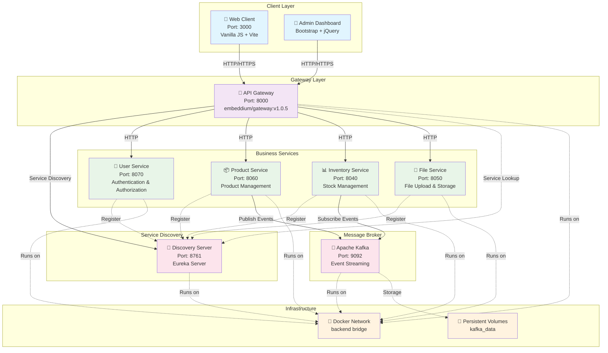
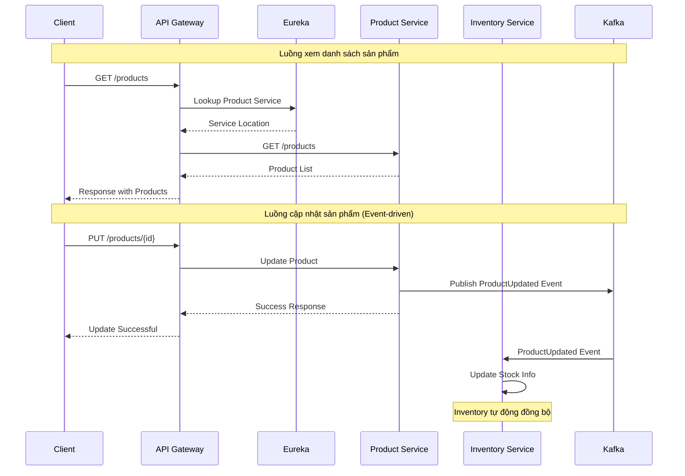
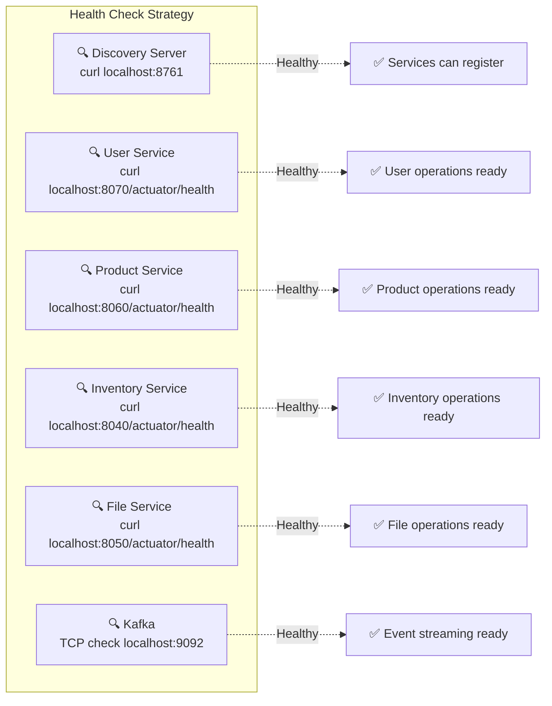

# BIỂU ĐỒ KIẾN TRÚC MICROSERVICE

```mermaid
graph TB
    subgraph "Client Layer"
        CLIENT[👥 Web Client<br/>Port: 3000<br/>Vanilla JS + Vite]
        ADMIN[🔧 Admin Dashboard<br/>Bootstrap + jQuery]
    end

    subgraph "Gateway Layer"
        GATEWAY[🚪 API Gateway<br/>Port: 8000<br/>embeddium/gateway:v1.0.5]
    end

    subgraph "Service Discovery"
        EUREKA[📍 Discovery Server<br/>Port: 8761<br/>Eureka Server]
    end

    subgraph "Business Services"
        USER[👤 User Service<br/>Port: 8070<br/>Authentication & Authorization]
        PRODUCT[📦 Product Service<br/>Port: 8060<br/>Product Management]
        INVENTORY[📊 Inventory Service<br/>Port: 8040<br/>Stock Management]
        FILE[📁 File Service<br/>Port: 8050<br/>File Upload & Storage]
    end

    subgraph "Message Broker"
        KAFKA[📡 Apache Kafka<br/>Port: 9092<br/>Event Streaming]
    end

    subgraph "Infrastructure"
        DOCKER[🐳 Docker Network<br/>backend bridge]
        VOLUMES[💾 Persistent Volumes<br/>kafka_data]
    end

    %% Client connections
    CLIENT -->|HTTP/HTTPS| GATEWAY
    ADMIN -->|HTTP/HTTPS| GATEWAY

    %% Gateway to services
    GATEWAY -->|Service Discovery| EUREKA
    GATEWAY -->|HTTP| USER
    GATEWAY -->|HTTP| PRODUCT
    GATEWAY -->|HTTP| INVENTORY
    GATEWAY -->|HTTP| FILE

    %% Service registration
    USER -.->|Register| EUREKA
    PRODUCT -.->|Register| EUREKA
    INVENTORY -.->|Register| EUREKA
    FILE -.->|Register| EUREKA
    GATEWAY -.->|Service Lookup| EUREKA

    %% Async communication
    PRODUCT -->|Publish Events| KAFKA
    INVENTORY -->|Subscribe Events| KAFKA

    %% Infrastructure dependencies
    USER -.->|Runs on| DOCKER
    PRODUCT -.->|Runs on| DOCKER
    INVENTORY -.->|Runs on| DOCKER
    FILE -.->|Runs on| DOCKER
    GATEWAY -.->|Runs on| DOCKER
    EUREKA -.->|Runs on| DOCKER
    KAFKA -.->|Runs on| DOCKER
    KAFKA -.->|Storage| VOLUMES

    %% Styling
    classDef clientClass fill:#e1f5fe
    classDef gatewayClass fill:#f3e5f5
    classDef serviceClass fill:#e8f5e8
    classDef infrastructureClass fill:#fff3e0
    classDef messageClass fill:#fce4ec

    class CLIENT,ADMIN clientClass
    class GATEWAY gatewayClass
    class USER,PRODUCT,INVENTORY,FILE serviceClass
    class DOCKER,VOLUMES infrastructureClass
    class KAFKA,EUREKA messageClass
```

## Luồng Request Processing

```mermaid
sequenceDiagram
    participant C as Client
    participant G as API Gateway
    participant E as Eureka
    participant P as Product Service
    participant I as Inventory Service
    participant K as Kafka

    Note over C,K: Luồng xem danh sách sản phẩm
    
    C->>G: GET /products
    G->>E: Lookup Product Service
    E-->>G: Service Location
    G->>P: GET /products
    P-->>G: Product List
    G-->>C: Response with Products

    Note over C,K: Luồng cập nhật sản phẩm (Event-driven)
    
    C->>G: PUT /products/{id}
    G->>P: Update Product
    P->>K: Publish ProductUpdated Event
    P-->>G: Success Response
    G-->>C: Update Successful
    
    K->>I: ProductUpdated Event
    I->>I: Update Stock Info
    Note over I: Inventory tự động đồng bộ
```

## Health Check Flow

```mermaid
graph LR
    subgraph "Health Check Strategy"
        HC1[🔍 Discovery Server<br/>curl localhost:8761]
        HC2[🔍 User Service<br/>curl localhost:8070/actuator/health]
        HC3[🔍 Product Service<br/>curl localhost:8060/actuator/health]
        HC4[🔍 Inventory Service<br/>curl localhost:8040/actuator/health]
        HC5[🔍 File Service<br/>curl localhost:8050/actuator/health]
        HC6[🔍 Kafka<br/>TCP check localhost:9092]
    end

    HC1 -.->|Healthy| START1[✅ Services can register]
    HC2 -.->|Healthy| START2[✅ User operations ready]
    HC3 -.->|Healthy| START3[✅ Product operations ready]
    HC4 -.->|Healthy| START4[✅ Inventory operations ready]
    HC5 -.->|Healthy| START5[✅ File operations ready]
    HC6 -.->|Healthy| START6[✅ Event streaming ready]
```